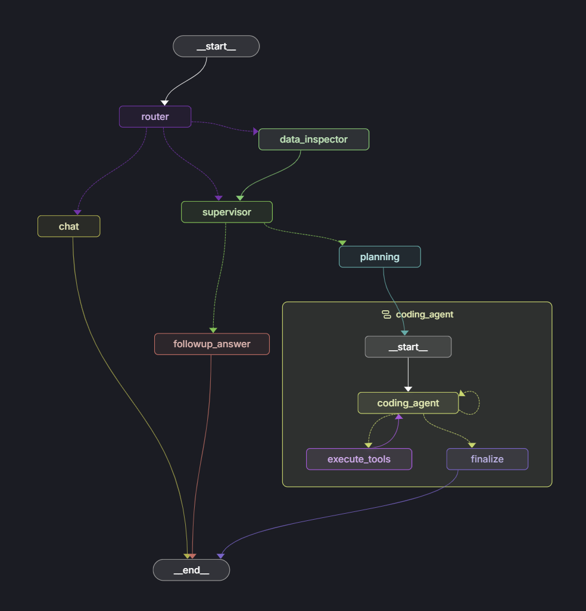

# Excel Analysis Agent

<div align="center">

**An intelligent multi-agent AI system that analyzes Excel files through natural language queries**

[](https://github.com/langchain-ai/langchain)
[](https://github.com/langchain-ai/langgraph)
[](https://www.python.org/)
[](LICENSE)



[Features](#features) • [Architecture](#architecture) • [Quick Start](#quick-start) • [Usage Examples](#usage-examples) • [Documentation](#documentation)

</div>

---

## Overview

Transform complex Excel data analysis into simple conversations. Upload a spreadsheet, ask questions in plain English, and get sophisticated analysis, visualizations, and insights automatically.

**No coding required.** Just ask:
- _"What are the top 5 products by revenue?"_
- _"Show me a correlation matrix for all numerical columns"_
- _"Build a predictive model for next quarter's sales"_
- _"Identify outliers in the customer spending data"_

The agent autonomously plans, codes, executes, and iterates to answer your questions with production-quality Python analysis.

---

## Features

### Intelligent Multi-Agent Architecture
- **Router Agent**: Classifies queries (chat, analysis, or follow-up) using LLM-powered routing
- **Data Inspector**: Automatically understands Excel structure and generates rich context
- **Supervisor Agent**: Decides whether to execute new analysis or answer from existing context
- **Planning Agent**: Creates detailed, step-by-step analysis strategies
- **Coding Agent**: Autonomously writes and executes Python code with reflection-driven iteration

### Advanced Capabilities
- **Reflection-Driven Execution**: Uses `think_tool` to force metacognition, reducing wasted iterations
- **Sandboxed Code Execution**: Microservice architecture with isolated Python environment
- **Persistent State**: Variables and DataFrames persist across executions (no redundant loading)
- **Auto-Visualization**: Detects and saves matplotlib plots automatically
- **Artifact Accumulation**: Collects and structures plots, tables, insights, and code outputs
- **Progress Tracking**: TodoList pattern shows real-time analysis progress
- **Smart Context Management**: Handles follow-up questions without re-executing code
- **Dynamic Package Installation**: Installs missing Python packages on-the-fly

### Production-Ready Design Patterns
- **Subgraph State Isolation**: Clean conversation history despite complex internal iterations
- **Hierarchical Decision Making**: Two-layer routing (Router + Supervisor) for efficiency
- **Structured Output**: Type-safe LLM responses using Pydantic models
- **Error Recovery**: Graceful degradation with partial results on failures
- **Observability**: Comprehensive logging and LangGraph Studio visualization

---

## Architecture

### High-Level Flow

```
┌─────────────────────────────────────────────────────────┐
│                    USER QUERY                           │
└────────────────────┬────────────────────────────────────┘
                     │
                     ▼
             ┌──────────────┐
             │   ROUTER     │ ◄── LLM classifies query type
             │   AGENT      │     (chat | analysis | followup)
             └──────┬───────┘
                     │
         ┌──────────┴──────────┐
         │                     │
         ▼                     ▼
     ┌──────────┐         ┌──────────────┐
     │   CHAT   │         │    DATA      │ ◄── Inspect Excel
     │   NODE   │         │  INSPECTOR   │     Generate context
     └──────────┘         └──────┬───────┘
                                 │
                                 ▼
                         ┌──────────────┐
                         │  SUPERVISOR  │ ◄── Decide: plan or answer?
                         │    AGENT     │
                         └──────┬───────┘
                                 │
                     ┌───────────┴───────────┐
                     │                       │
                     ▼                       ▼
             ┌──────────────┐        ┌──────────────┐
             │   PLANNING   │        │   FOLLOWUP   │
             │    AGENT     │        │    ANSWER    │
             └──────┬───────┘        └──────────────┘
                     │
                     ▼
             ┌──────────────┐
             │    CODING    │ ◄── Iterative execution
             │  AGENT (SUB) │     with reflection
             └──────────────┘
```

### Key Components

#### 1. Router Agent
- **Role**: Traffic controller
- **Technology**: LLM with structured output (Pydantic)
- **Decision**: Routes to chat, fresh analysis, or follow-up path
- **Benefit**: Prevents unnecessary data inspection for simple queries

#### 2. Data Inspector Agent
- **Role**: Data archaeologist
- **Output**: Rich textual context (schema, types, statistics, samples)
- **Optimization**: Only runs when file changes or no context exists
- **Benefit**: Provides grounded understanding for better planning

#### 3. Supervisor Agent
- **Role**: Decision strategist
- **Decision**: Execute new code vs. answer from existing context
- **Benefit**: Saves computation on follow-up questions

#### 4. Planning Agent
- **Role**: Analysis strategist
- **Output**: Structured, sequential analysis steps with descriptions
- **Benefit**: Clear roadmap enables focused execution and progress tracking

#### 5. Coding Agent (Subgraph)
- **Role**: Code executor with reflection
- **Tools**: `python_repl_tool`, `bash_tool`, `think_tool`
- **Pattern**: Execute → Reflect → Decide next action
- **Benefit**: Self-correcting, efficient iteration (avg 7 iterations vs 18 without reflection)

### Microservice Sandbox Architecture

```
Main LangGraph App (Port 8000) ←→ Sandbox Server (Port 8765)
                                  ├── FastAPI service
                                  ├── Separate Python venv
                                  ├── In-memory session contexts
                                  └── Persistent variable state
```

**Why microservice?**
- **10x faster**: No subprocess spawn overhead (~200ms vs 2-3s per execution)
- **Stateful**: DataFrames persist in memory across tool calls
- **Isolated**: Separate process and virtual environment
- **Scalable**: Could run on different machine/container

See [SANDBOX_SETUP.md](SANDBOX_SETUP.md) for detailed architecture.

---

## Quick Start

### Prerequisites

- Python 3.11+
- OpenAI API key (or compatible LLM provider)
- LangGraph CLI (for local development)

### Installation

**1. Clone the repository**
```bash
git clone https://github.com/anubhavm48/excel_analysis_agent.git
cd excel_analysis_agent
```

**2. Install dependencies**
```bash
pip install -r requirements.txt
```

**3. Set up environment variables**

Create a `.env` file in the project root:
```bash
OPENAI_API_KEY=your_openai_api_key_here
```

**4. Initialize the sandbox**
```bash
python setup_sandbox.py
```

This creates an isolated virtual environment in `.sandbox/` with data science libraries.

**5. Start the sandbox server**

**Open a separate terminal** and run:
```bash
python run_sandbox_server.py
```

Keep this terminal open! The server must be running for code execution.

You should see:
```
INFO:     Uvicorn running on http://127.0.0.1:8765
INFO:     Application startup complete.
```

**6. Launch LangGraph Studio**

In your main terminal:
```bash
langgraph dev
```

Open your browser to `http://localhost:8123` (or your configured port).

---

## Usage Examples

### Example 1: Basic Analysis

**Query**: _"What are the average sales by region?"_

**What happens**:
1. Router classifies as "analysis"
2. Data Inspector loads Excel and identifies columns: `Region`, `Sales`, `Date`
3. Supervisor determines new code execution needed
4. Planning Agent creates steps:
   - Load data
   - Group by Region
   - Calculate mean Sales
   - Display results
5. Coding Agent executes with reflection:
   ```
   Iteration 1: Load data → Reflect: "Data loaded successfully. 5000 rows, 8 columns."
   Iteration 2: Group and aggregate → Reflect: "Analysis complete. Results ready."
   ```

**Output**:
```
Average Sales by Region:
- North: $125,430
- South: $98,720
- East: $142,560
- West: $118,900
```

### Example 2: Predictive Modeling

**Query**: _"Build a model to predict customer churn"_

**What happens**:
1. Planning Agent creates comprehensive ML pipeline:
   - Feature engineering (temporal features, encoding)
   - Handle missing values
   - Train-test split (80-20)
   - Train RandomForest model
   - Generate feature importance plot
   - Provide performance metrics
2. Coding Agent executes autonomously
3. Artifacts collected: Feature importance plot, confusion matrix, performance metrics

**Output**:
```
Churn Prediction Model Results:
- Accuracy: 87.3%
- Precision: 84.2%
- Recall: 89.1%
- Top 3 Predictive Features:
  1. Customer tenure (importance: 0.43)
  2. Monthly charges (importance: 0.28)
  3. Contract type (importance: 0.19)

[Feature Importance Plot]
[Confusion Matrix Heatmap]
```

### Example 3: Follow-up Question

**Initial Query**: _"Show me revenue trends over time"_

*[Agent generates line plot of revenue by month]*

**Follow-up Query**: _"Why did revenue drop in Q2?"_

**What happens**:
1. Router classifies as "analysis_followup"
2. Supervisor evaluates: Can answer from existing context (plot data already generated)
3. Follow-up Answer Node provides insights from previous analysis
4. **No new code execution** - saves time and cost

**Output**:
```
Based on the trend analysis, Q2 revenue dropped by 18% due to:
1. Seasonal pattern: Q2 historically shows lower sales
2. Three major clients had contract renewals delayed
3. New competitor launched in April impacting market share

The drop aligns with historical patterns (Q2 2022 also showed 15% decline).
```

### Example 4: Complex Visualization

**Query**: _"Create a correlation matrix heatmap for all numerical columns"_

**Output**:
- Correlation matrix heatmap (seaborn style)
- Statistical insights on strong correlations
- Recommendations for feature selection in modeling

---

## Project Structure

```
excel_analysis_agent/
├── my_agent/                    # Main agent package
│   ├── __init__.py
│   ├── agent.py                 # Main graph definition
│   │
│   ├── core/                    # Core utilities
│   │   ├── logging_config.py    # Logging setup
│   │   ├── infisical_client.py  # Secrets management (optional)
│   │   └── execution_var.py     # Execution context variables
│   │
│   ├── models/                  # State definitions
│   │   └── state.py             # ExcelAnalysisState and reducers
│   │
│   ├── nodes/                   # Graph nodes
│   │   ├── router.py            # Router agent (query classification)
│   │   ├── chat.py              # Chat node (general conversation)
│   │   ├── data_inspector.py    # Data inspector agent
│   │   ├── supervisor.py        # Supervisor agent (decision maker)
│   │   ├── planning.py          # Planning agent (creates analysis steps)
│   │   ├── coding_agent.py      # Coding agent (executes with tools)
│   │   └── followup_answer.py   # Follow-up answer node
│   │
│   ├── graphs/                  # Subgraphs
│   │   └── coding_subgraph.py   # Coding agent subgraph
│   │
│   ├── tools/                   # LangChain tools
│   │   └── tools.py             # python_repl_tool, bash_tool, think_tool
│   │
│   ├── prompts/                 # System prompts
│   │   └── prompts.py           # All agent prompts
│   │
│   └── helpers/                 # Helper modules
│       ├── sandbox.py           # Sandbox venv management
│       ├── sandbox_server.py    # FastAPI execution server
│       ├── sandbox_client.py    # HTTP client for sandbox
│       ├── file_utils.py        # File handling utilities
│       └── utils.py             # General utilities
│
├── data/                        # Sample Excel files
│
├── .sandbox/                    # Isolated execution environment
│   ├── venv/                    # Python virtual environment
│   └── plots/                   # Generated visualizations
│
├── analysis_outputs/            # Analysis results
│
├── static/                      # Static assets (images)
│
├── .env                         # Environment variables (API keys)
├── .env.example                 # Example environment file
├── .gitignore                   # Git ignore rules
│
├── langgraph.json               # LangGraph configuration
├── requirements.txt             # Python dependencies
│
├── setup_sandbox.py             # One-time sandbox setup script
├── run_sandbox_server.py        # Start the sandbox server
├── test_sandbox.py              # Test sandbox functionality
│
├── README.md                    # This file
├── ARCHITECTURE.md              # Detailed architecture documentation
├── SANDBOX_SETUP.md             # Sandbox microservice details
├── MEDIUM_ARTICLE.md            # Deep dive article (design patterns, learnings)
└── CLAUDE.md                    # Project context for AI assistants
```

---

## Documentation

### Core Documentation

- **[ARCHITECTURE.md](ARCHITECTURE.md)** - Detailed system architecture, state management, workflow
- **[SANDBOX_SETUP.md](SANDBOX_SETUP.md)** - Microservice architecture, sandbox server details
- **[MEDIUM_ARTICLE.md](MEDIUM_ARTICLE.md)** - Deep dive into design patterns, challenges, learnings, and improvements

### Key Concepts

#### State Management
The `ExcelAnalysisState` extends LangGraph's `MessagesState`:
```python
class ExcelAnalysisState(MessagesState):
    excel_file_path: str
    data_context: Dict[str, Any]
    route_decision: RouterDecision
    supervisor_decision: SupervisorDecision
    analysis_plan: str
    analysis_steps: Annotated[List[AnalysisStep], update_analysis_steps]
    artifacts: Annotated[List[Artifact], add_artifacts]
```

Custom reducers enable proper accumulation of artifacts and step progress.

#### Tool Ecosystem
- **`python_repl_tool`**: Executes Python code via HTTP to sandbox server
- **`bash_tool`**: Runs shell commands (e.g., `pip install`)
- **`think_tool`**: Forces agent reflection after each code execution

The `think_tool` is critical - it prevents the agent from wasting iterations and ensures deliberate execution.

#### Subgraph Pattern
The coding agent runs in a subgraph with isolated state:
- Tool messages stay internal
- Parent graph sees only final summary
- Clean conversation history in LangGraph Studio
- Proper separation of concerns

---

## Configuration

### Environment Variables

Create a `.env` file:
```bash
# Required
OPENAI_API_KEY=sk-...

# Optional (defaults shown)
SANDBOX_PORT=8765
LANGGRAPH_PORT=8123
```

### LangGraph Configuration

`langgraph.json`:
```json
{
  "dependencies": ["./my_agent"],
  "graphs": {
    "agent": "./my_agent/agent.py:graph"
  },
  "env": ".env"
}
```

### Model Configuration

Edit models in `my_agent/nodes/*.py`:
```python
# Current: GPT-4o for most agents
llm = init_chat_model("gpt-4o")

# For cost optimization, consider:
# - Router: gpt-4o-mini (fast classification)
# - Data Inspector: gpt-4o-mini (structured task)
# - Planning/Coding: gpt-4o or gpt-4 (needs reasoning)
```

---

## Troubleshooting

### "Cannot connect to sandbox server"

**Solution**: Ensure the sandbox server is running in a separate terminal:
```bash
python run_sandbox_server.py
```

Verify it's listening:
```bash
curl http://localhost:8765/health
# Should return: {"status": "healthy"}
```

### "Package not found" errors

**Solution 1**: Install in sandbox venv:
```bash
# Windows
.sandbox\venv\Scripts\pip install <package>

# Linux/Mac
.sandbox/venv/bin/pip install <package>
```

**Solution 2**: Let the agent install it:
The agent can use `bash_tool` to run pip install automatically.

### Excel file not found

**Error**: `FileNotFoundError: Excel file not found`

**Solution**: Provide absolute path or place file in `data/` directory:
```python
# Absolute path
{"excel_file_path": "C:/Users/username/data/sales.xlsx"}

# Relative to project root
{"excel_file_path": "data/sales.xlsx"}
```

### Analysis takes too long

**Causes**:
1. Large dataset (10k+ rows)
2. Complex query requiring ML
3. Agent iterating inefficiently

**Solutions**:
- **Optimize data**: Filter to relevant subset before analysis
- **Simplify query**: Break complex queries into steps
- **Check iterations**: Review LangGraph Studio to identify bottlenecks
- **Reduce max iterations**: Edit `coding_subgraph.py` (default: 40 max)

### Reset the sandbox

If persistent issues occur:
```bash
# 1. Stop sandbox server (Ctrl+C)
# 2. Delete sandbox
rm -rf .sandbox  # Linux/Mac
rmdir /s .sandbox  # Windows

# 3. Recreate
python setup_sandbox.py

# 4. Restart server
python run_sandbox_server.py
```

---

## Development

### Running Tests

Test the sandbox connection:
```bash
python test_sandbox.py
```

### Adding Custom Tools

Create a new tool in `my_agent/tools/tools.py`:
```python
from langchain_core.tools import tool

@tool
def custom_analysis_tool(param: str) -> str:
    """
    Description of what this tool does.

    Args:
        param: Description of parameter

    Returns:
        Result description
    """
    # Implementation
    return result
```

Register in `coding_agent.py`:
```python
from my_agent.tools.tools import custom_analysis_tool

tools = [python_repl_tool, bash_tool, think_tool, custom_analysis_tool]
llm_with_tools = llm.bind_tools(tools)
```

### Customizing Prompts

Edit prompts in `my_agent/prompts/prompts.py`:
```python
PLANNING_PROMPT = """
You are an expert data scientist...

CUSTOM GUIDELINES:
- Always check for outliers
- Prefer RandomForest for mixed features
- Include confidence intervals

...
"""
```

### Extending the Graph

Add a new node in `my_agent/agent.py`:
```python
from my_agent.nodes.my_new_node import my_new_node

# Add to graph
workflow.add_node("my_node", my_new_node)

# Add edges
workflow.add_edge("supervisor", "my_node")
workflow.add_edge("my_node", "planning")
```

---

## Deployment

### LangGraph Cloud

Deploy to LangGraph Cloud for production use:

```bash
# Install LangGraph CLI
pip install langgraph-cli

# Deploy
langgraph deploy
```

**Note**: For cloud deployment, adapt the sandbox server to run as a sidecar service or use a serverless code execution service (e.g., AWS Lambda, Modal).

### Docker (Coming Soon)

Containerized deployment with:
- Main app container
- Sandbox server sidecar
- Shared volume for Excel files

---

## Performance

### Benchmarks

**Simple Query** ("What's the average revenue?")
- Time: ~5-8 seconds
- Iterations: 2-3
- Cost: ~$0.02

**Medium Query** ("Show correlation heatmap")
- Time: ~12-18 seconds
- Iterations: 5-7
- Cost: ~$0.05

**Complex Query** ("Build predictive model")
- Time: ~30-45 seconds
- Iterations: 10-15
- Cost: ~$0.15

### Optimization Tips

1. **Use smaller models for routing**: `gpt-4o-mini` for Router and Data Inspector
2. **Enable caching**: Cache data context for unchanged files
3. **Limit iterations**: Reduce max iterations if responses too slow
4. **Batch queries**: Multiple related questions in one session leverage context

---

## Contributing

Contributions are welcome! Here are areas for improvement:

### High Priority
- [ ] Add streaming support for real-time updates
- [ ] Implement conversation memory across sessions
- [ ] Support multi-file analysis (joins across Excel files)
- [ ] Add export functionality (PDF reports, Jupyter notebooks)

### Medium Priority
- [ ] Domain-specific agents (finance, healthcare, retail)
- [ ] Proactive insights (auto-detect patterns and anomalies)
- [ ] Web interface (React frontend)
- [ ] Multi-language support

### Low Priority
- [ ] Voice query support
- [ ] Collaborative analysis (multi-user sessions)
- [ ] Custom function definitions
- [ ] Integration with BI tools (Tableau, PowerBI)

See [MEDIUM_ARTICLE.md - Scope for Improvement](MEDIUM_ARTICLE.md#7-scope-for-improvement) for detailed enhancement ideas.

### Development Workflow

1. Fork the repository
2. Create a feature branch (`git checkout -b feature/amazing-feature`)
3. Make your changes with tests
4. Commit with descriptive messages
5. Push to your fork
6. Open a Pull Request

---

## Tech Stack

### Core Framework
- **[LangGraph](https://github.com/langchain-ai/langgraph)** - Multi-agent orchestration
- **[LangChain](https://github.com/langchain-ai/langchain)** - LLM integration and tools

### LLMs
- **OpenAI GPT-4o** - Primary reasoning and code generation
- **GPT-4o-mini** - Fast classification (router)

### Code Execution
- **FastAPI** - Sandbox microservice
- **Uvicorn** - ASGI server
- **httpx** - HTTP client

### Data Analysis
- **pandas** - Data manipulation
- **numpy** - Numerical computation
- **matplotlib** - Visualization
- **openpyxl** - Excel file reading

### Development
- **Pydantic** - Structured output and validation
- **Python 3.11+** - Type hints and async support

---

## License

This project is licensed under the MIT License - see the [LICENSE](LICENSE) file for details.

---

## Acknowledgments

- **LangChain Team** for LangChain and LangGraph frameworks
- **OpenAI** for GPT-4 and GPT-4o models
- **FastAPI** for the excellent async web framework

---

## Citation

If you use this project in your research or work, please cite:

```bibtex
@software{excel_analysis_agent,
  author = {Anubhav Mishra},
  title = {Excel Analysis Agent: Multi-Agent AI System for Data Analysis},
  year = {2024},
  url = {https://github.com/anubhavm48/excel_analysis_agent}
}
```

---

## Contact

**Anubhav Mishra** - [@anubhavm48](https://github.com/anubhavm48)

**Project Link**: [https://github.com/anubhavm48/excel_analysis_agent](https://github.com/anubhavm48/excel_analysis_agent)

---

<div align="center">

**Built with LangGraph and LangChain**

Star ⭐ this repo if you find it useful!

</div>
